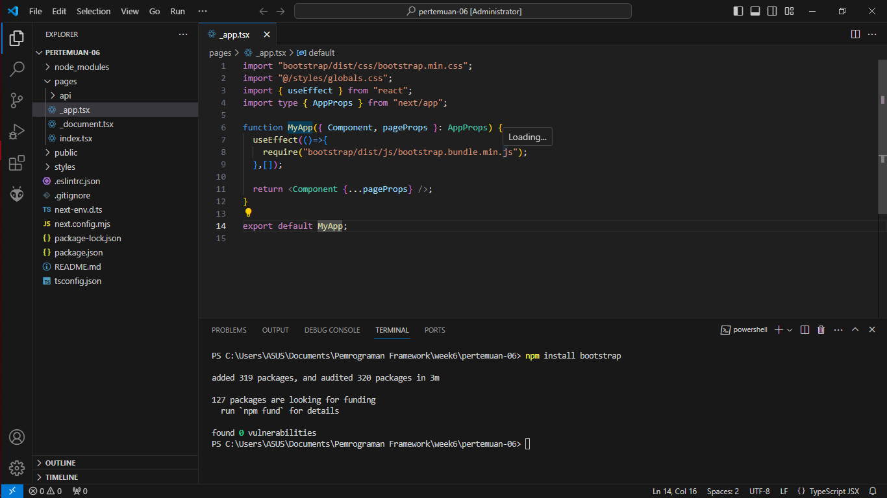
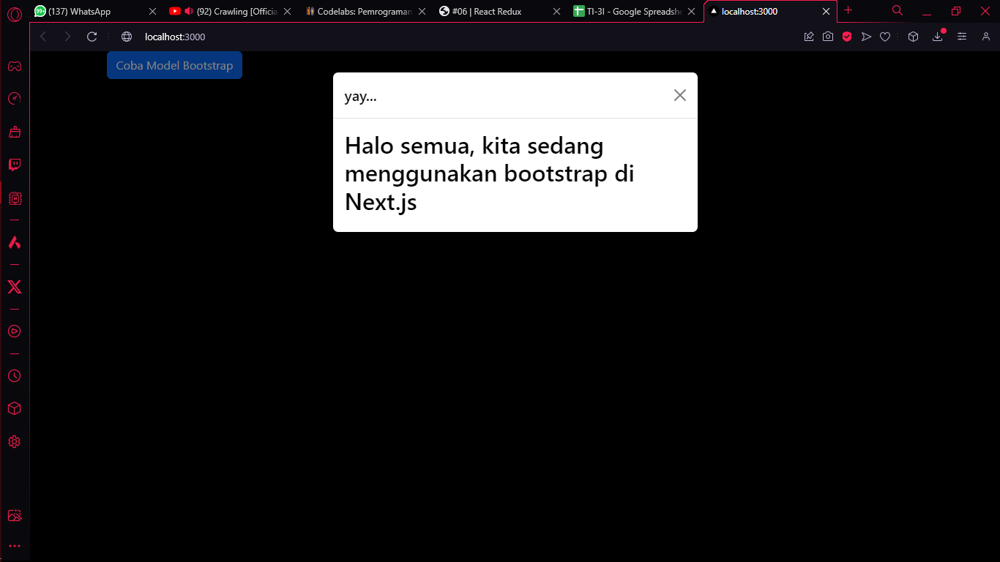
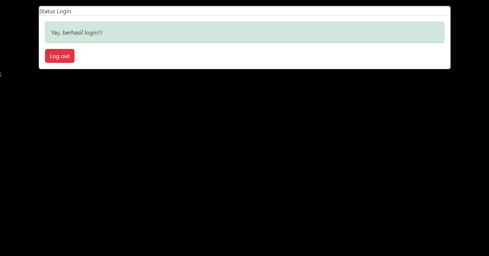
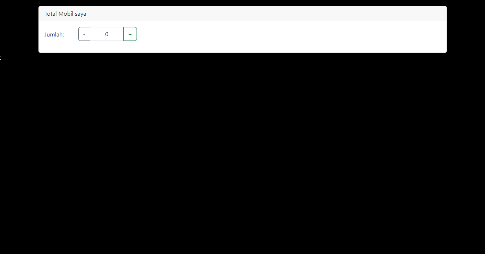
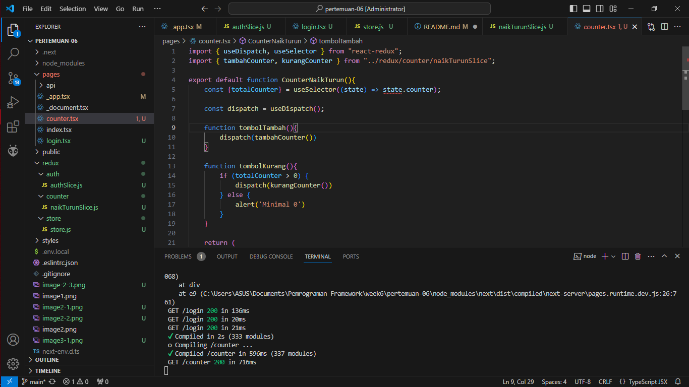

This is a [Next.js](https://nextjs.org/) project bootstrapped with [`create-next-app`](https://github.com/vercel/next.js/tree/canary/packages/create-next-app).

## Getting Started

First, run the development server:

```bash
npm run dev
# or
yarn dev
# or
pnpm dev
# or
bun dev
```

Open [http://localhost:3000](http://localhost:3000) with your browser to see the result.

You can start editing the page by modifying `pages/index.tsx`. The page auto-updates as you edit the file.

[API routes](https://nextjs.org/docs/api-routes/introduction) can be accessed on [http://localhost:3000/api/hello](http://localhost:3000/api/hello). This endpoint can be edited in `pages/api/hello.ts`.

The `pages/api` directory is mapped to `/api/*`. Files in this directory are treated as [API routes](https://nextjs.org/docs/api-routes/introduction) instead of React pages.

This project uses [`next/font`](https://nextjs.org/docs/basic-features/font-optimization) to automatically optimize and load Inter, a custom Google Font.

## Learn More

To learn more about Next.js, take a look at the following resources:

- [Next.js Documentation](https://nextjs.org/docs) - learn about Next.js features and API.
- [Learn Next.js](https://nextjs.org/learn) - an interactive Next.js tutorial.

You can check out [the Next.js GitHub repository](https://github.com/vercel/next.js/) - your feedback and contributions are welcome!

## Deploy on Vercel

The easiest way to deploy your Next.js app is to use the [Vercel Platform](https://vercel.com/new?utm_medium=default-template&filter=next.js&utm_source=create-next-app&utm_campaign=create-next-app-readme) from the creators of Next.js.

Check out our [Next.js deployment documentation](https://nextjs.org/docs/deployment) for more details.


Praktikum 1



Praktikum 2 
Soal
Coba akses http://localhost:3000/login, dan klik tombol login. Kemudian lakukan refresh page berkali-kali (jika perlu restart npm run dev nya). Simpulkan apa yang terjadi ?
Jawab:



Baris 25 dan 30 terdapat method parse(), apa yang terjadi jika kita tidak menggunakan method tersebut?
Jawab:
Hal ini dilakukan untuk merender elemen tersebut sebagai elemen JSX dengan latar belakang. Jika kami tidak menambahkan parse, parse akan ditampilkan sebagai string HTML biasa.

Praktikum 3



Tugas (Pertanyaan Praktikum)
Berdasarkan pada praktikum sebelumnya yang telah dilakukan, beberapa pertanyaan terkait praktikum perlu diselesaikan yaitu sebagai berikut.

Apa kegunaan dari kode ini import { useEffect } from "react"; Pada file pages/_app.tsx? jelaskan
Jawab:
Kegunaan kode tersebut adalah untuk melakukan pengambilan data pada komponen fungsi. Dalam hal ini, data yang diambil adalah data yang berisi file konfigurasi untuk bootstrap sehingga dapat kita implementasi di website.

Jika pada file pages/_app.tsx kita tidak menggunakan useEffect (menghapus baris 3, dan baris 9-11, apa yang akan terjadi?
Jawab:
Jika useEffect tidak diimplementasikan, maka program tidak dapat berjalan karena data konfigurasi bootstrap yang diperlukan tidak tersedia karena useEffect dihapus. Oleh karena itu, program harus dijalankan tanpa useEffect atau mengimplementasikan useEffect terlebih dahulu.

Mengapa di react/nextjs penulisan tag html untuk class, harus diganti menjadi className ?
Jawab:
className digunakan sebagai pengganti kelas karena ini adalah tag JSX untuk kelas dalam HTML. Jika kita tidak menggunakan tag ini, Next.js tidak akan membaca kode HTML sebaris kita dan karenanya akan menghasilkan kesalahan.

Apakah store pada nextjs bisa menyimpan banyak redux reducer?
Jawab:
Bisa ,kita dapat menyimpan banyak redux reducer di store.js. Mereka dapat disimpan dalam fungsi yang sama atau berbeda.
Jelaskan kegunaan dari file store.js!
Jawab:
digunakan untuk menyimpan data secara lokal di peramban pengguna. Ini memungkinkan aplikasi web untuk menyimpan data seperti preferensi pengguna, status sesi, atau data lainnya tanpa harus selalu mengambilnya dari server,Dengan menyimpan data secara lokal, aplikasi dapat meningkatkan kinerja dengan menghindari permintaan berulang ke server untuk data yang sama. Hal ini sangat berguna dalam situasi di mana koneksi internet mungkin tidak stabil atau lambat

Pada file pages/login.tsx, apa maksud dari kode ini ?
const { isLogin } = useSelector((state) => state.auth);
Jawab:
Kegunaan kode tersebut adalah untuk mengambil status dalam situs web, lalu mengganti status situs web tersebut setiap pengguna melakukan tindakan untuk mengubah status situs web. Dalam hal ini auth artinya otorisasi, jadi fungsi ini dibuat untuk proses Login/Logout.

Pada file pages/counter.tsx, apa maksud dari kode ini?
const {totalCounter} = useSelector((state) => state.counter);

Jawab:
useSelector: Ini adalah hook yang disediakan oleh React Redux. Hook ini digunakan untuk mengekstrak bagian tertentu dari state Redux ke dalam komponen React. Dalam konteks ini, kita menggunakan useSelector untuk mengambil nilai tertentu dari state Redux.

(state) => state.counter: Ini adalah fungsi selektor yang digunakan oleh useSelector. Fungsi ini menerima state lengkap dari Redux store sebagai argumen dan mengembalikan bagian tertentu dari state yang ingin diambil. Dalam kasus ini, kita ingin mengambil nilai dari properti counter dalam state Redux.

{totalCounter}: Setelah menggunakan useSelector, kita mendapatkan nilai totalCounter dari properti counter dalam state Redux. Ini adalah cara untuk mengakses nilai tertentu dalam state Redux menggunakan useSelector. totalCounter adalah nama variabel yang digunakan untuk menyimpan nilai tersebut dalam komponen counter.tsx.